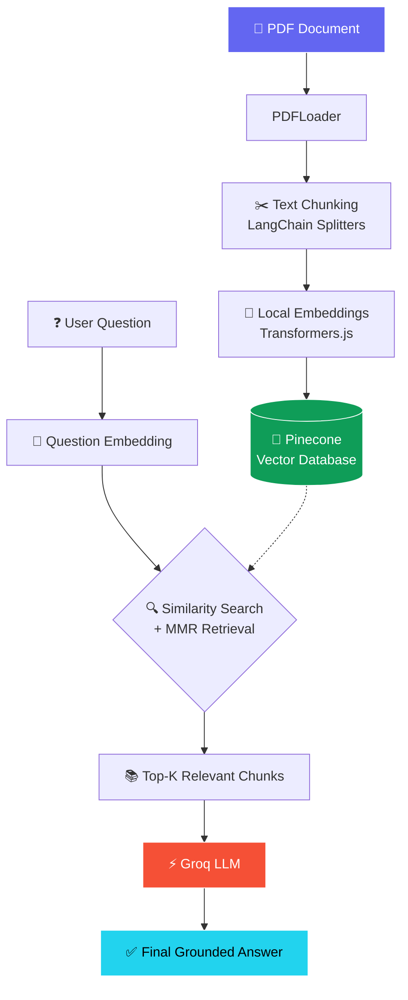
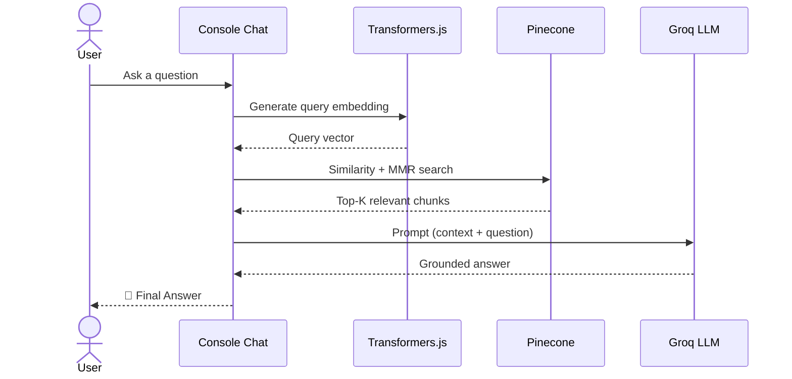
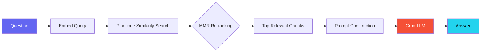

# Multi-model-RAG-System

<div align="center">


<br/>

<a href="#">
  
</a>

<br/><br/>


<br/>


</div>

<br/>

## 📖 Table of Contents

- [Overview](#-overview)
- [Architecture](#️-architecture)
- [Features](#-features)
- [Tech Stack](#️-tech-stack)
- [Project Structure](#-project-structure)
- [Installation](#-installation)
- [Environment Variables](#-environment-variables)
- [Usage](#-usage)
- [Retrieval Pipeline Deep Dive](#-retrieval-pipeline-deep-dive)
- [Roadmap](#-roadmap)
- [Learning Outcomes](#-learning-outcomes)
- [Contributing](#-contributing)
- [Author](#-author)
- [License](#-license)

<br/>

## 🧩 Overview

**RAG System** is an end-to-end **Retrieval Augmented Generation** pipeline built entirely in **Node.js**, designed to let you have natural language conversations with your own PDF documents.

Instead of relying on an LLM's frozen training data, this system:

1. **Ingests** your PDFs and splits them into semantically meaningful chunks
2. **Embeds** those chunks locally (no API cost) using Transformers.js
3. **Stores & indexes** the vectors in Pinecone for fast similarity search
4. **Retrieves** the most relevant chunks for any user question using MMR
5. **Generates** grounded, hallucination-resistant answers using Groq's blazing-fast LLM inference

> 💡 Think of it as giving an LLM an "open-book exam" — it only answers using what it retrieves from *your* documents.

<br/>

## 🏗️ Architecture

### End-to-End Flow



### Sequence: What Happens on Every Query



### Two-Pipeline Design

| Pipeline | When it Runs | Purpose |
|---|---|---|
| 🗂️ **Ingestion** | Once, or when docs change (`node index.js`) | Load → Chunk → Embed → Store in Pinecone |
| 💬 **Retrieval + Generation** | Every user query (`node test.js`) | Embed query → Search → Retrieve → Generate answer |

<br/>

## ✨ Features

| | Feature | Description |
|---|---|---|
| ✅ | **PDF Upload & Processing** | Load and parse any PDF via `PDFLoader` |
| ✅ | **Smart Text Chunking** | LangChain text splitters for semantically coherent chunks |
| ✅ | **Local Embeddings** | Zero-cost, offline embedding generation via Transformers.js |
| ✅ | **Vector Storage** | Persistent, scalable storage & indexing in Pinecone |
| ✅ | **Semantic Search** | Cosine-similarity based retrieval over embedded chunks |
| ✅ | **MMR Retrieval** | Max Marginal Relevance to reduce redundant/duplicate chunks |
| ✅ | **Interactive Console Chat** | Real-time Q&A loop directly from your terminal |
| ✅ | **Production-Grade Design** | Modular files, `.env`-based config, clean separation of concerns |

<br/>

## 🛠️ Tech Stack

<div align="center">


&nbsp;&nbsp;


</div>

| Library | Purpose |
|---|---|
| `@langchain/community` | PDF loading |
| `@langchain/textsplitters` | Text chunking |
| `@langchain/pinecone` | Pinecone integration for LangChain |
| `@pinecone-database/pinecone` | Vector database client |
| `@xenova/transformers` | Local embedding generation |
| `@langchain/groq` | LLM inference via Groq |

<br/>

## 📂 Project Structure

```text
RAG_System/
│
├── prepare.js         # Loads, chunks, and prepares documents
├── index.js            # Runs full ingestion pipeline → Pinecone
├── askQuestion.js       # Handles query embedding + retrieval logic
├── vectorStore.js       # Pinecone client & vector store setup
├── llm.js               # Groq LLM configuration & prompt handling
├── test.js              # Interactive console chat entry point
├── policy.pdf           # Sample source document
├── .env                 # API keys (not committed)
└── package.json
```

<br/>

## ⚙️ Installation

```bash
# Clone the repository
git clone https://github.com/yourusername/rag-system.git
cd rag-system

# Install dependencies
npm install
```

<br/>

## 🔑 Environment Variables

Create a `.env` file in the root directory:

```env
PINECONE_API_KEY=your_pinecone_api_key
GROQ_API_KEY=your_groq_api_key
```

> ⚠️ Never commit your `.env` file. Add it to `.gitignore`.

<br/>

## 💬 Usage

### Step 1 — Index Your Documents

```bash
node index.js
```

This will:
- 📄 Load the PDF
- ✂️ Split it into chunks
- 🧠 Generate embeddings locally
- 🌲 Store vectors in Pinecone

### Step 2 — Start Chatting

```bash
node test.js
```

**Example session:**

```text
You: What is an instance?
Bot: An instance is an object created from a class.

You: What is inheritance?
Bot: Inheritance allows a class to acquire properties and behavior
     from another class, promoting code reuse.
```

<br/>

## 🔍 Retrieval Pipeline Deep Dive



**Why MMR (Max Marginal Relevance)?**
Plain top-K similarity search often returns near-duplicate chunks. MMR balances **relevance** to the query with **diversity** among selected chunks — giving the LLM a broader, less redundant context window and improving answer quality.

<br/>

## 🗺️ Roadmap

### 📈 Current Improvements
- [x] MMR Retrieval
- [x] Better Chunking Strategy
- [x] Prompt Engineering
- [x] Interactive Console Chat

### 🚀 Future Improvements
- [ ] Web Interface (React/Next.js frontend)
- [ ] Source Citations in Answers
- [ ] Hybrid Search (Vector + BM25/Keyword)
- [ ] Reranking (Cross-Encoder)
- [ ] Multi-Query Retrieval
- [ ] Conversational Memory
- [ ] Image Embeddings
- [ ] Voice Embeddings
- [ ] Multi-Modal RAG
- [ ] Agentic RAG (self-directed multi-hop retrieval)

### 🖼️ Upcoming: Image RAG
- Image embeddings
- Visual similarity search
- Visual Question Answering (VQA)

### 🎙️ Upcoming: Voice RAG
- Speech-to-Text ingestion
- Audio embeddings
- Voice chat with documents

<br/>

## 🎯 Learning Outcomes

<div align="center">


</div>

<br/>

## 🤝 Contributing

Contributions are welcome! Feel free to:

1. Fork the repository
2. Create a feature branch (`git checkout -b feature/amazing-feature`)
3. Commit your changes (`git commit -m 'Add amazing feature'`)
4. Push to the branch (`git push origin feature/amazing-feature`)
5. Open a Pull Request

<br/>

## 👨‍💻 Author

<div align="center">

### **Pranav Amrutkar**

Electronics & Telecommunication Engineering @ VIIT Pune
Full Stack Developer • GenAI Enthusiast • Building AI Products & RAG Systems


</div>

<br/>

## 📜 License

This project is licensed under the **MIT License** — feel free to use, modify, and distribute.

<br/>

<div align="center">

### ⭐ If you found this project useful, please consider giving it a star!


</div>
